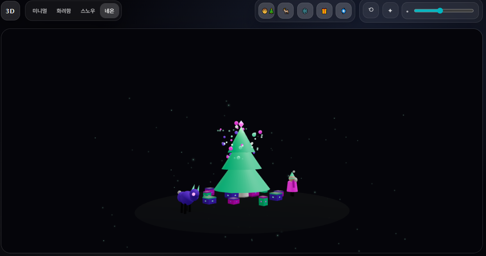
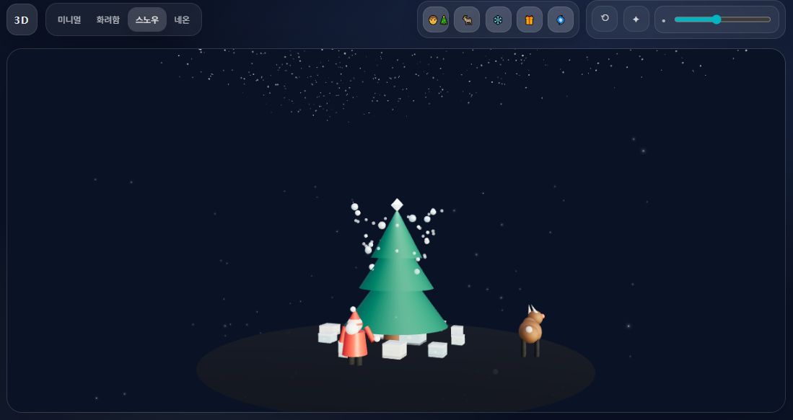

# 🎄 3D Christmas Tree (R3F)

React Three Fiber로 구현한 3D 크리스마스 트리 씬입니다.  
바람에 흔들리는 트리, 테마별 카메라 프리셋, 네온 체이스 조명, 루돌프/선물 이벤트를 포함합니다.

## Screenshots

| Neon Theme                      | Snow Theme                      |
| ------------------------------- | ------------------------------- |
|  |  |

## Features

- Wind sway: 트리의 미세한 흔들림 애니메이션
- Camera presets: 테마 변경 시 카메라 포지션/타겟/FOV 부드러운 전환
- Neon chase: 헬릭스 라이트 순차 점등 효과
- Rudolph: 가끔 트리 방향으로 고개를 돌리는 애니메이션
- Gift event: 랜덤 트리거로 선물 뚜껑이 살짝 열리고 스파클 이펙트 발생

## Tech Stack

- React
- Three.js
- @react-three/fiber, @react-three/drei

## Run

```bash
npm install
npm start
```
